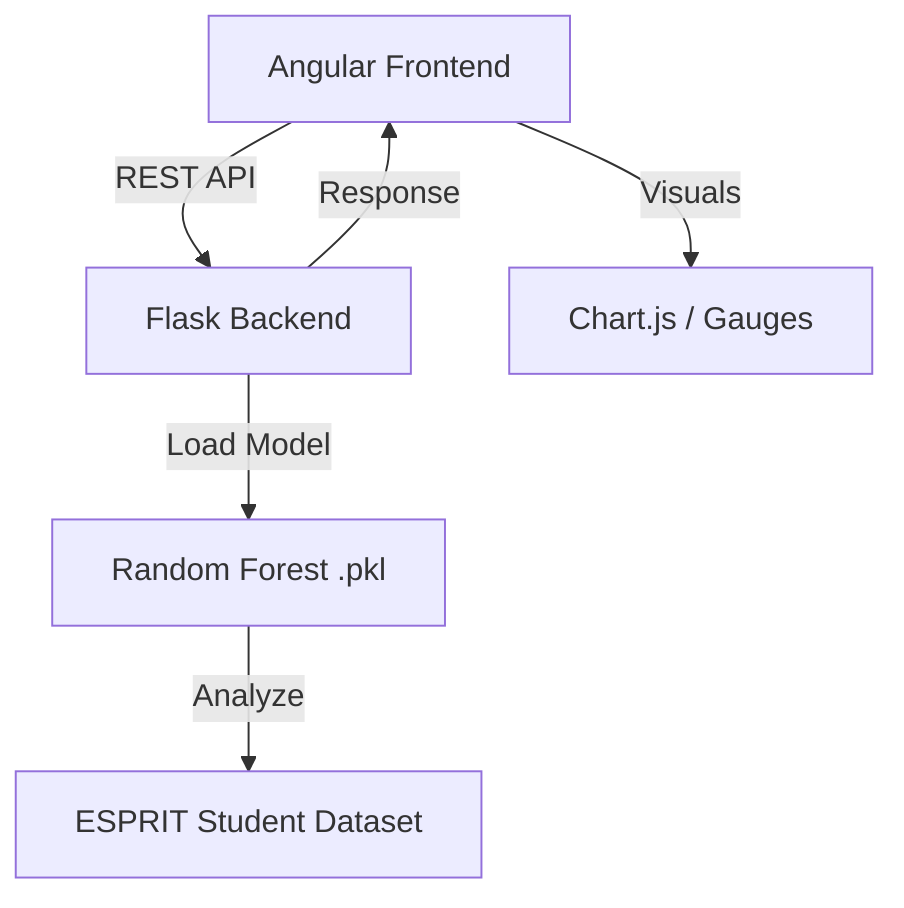

# 🎓 Start Smart: AI-Powered Academic Risk Assessment


**Start Smart** is an intelligent educational platform designed for engineering students at ESPRIT. It leverages Machine Learning to detect early signals of academic failure and provides personalized learning interventions through gamification (BrainRush) and AI-driven tutoring.

---

## 🚀 Key Features

- **Early Risk Detection:** ML models trained on 1,800+ student profiles to identify risk levels 2-4 weeks before exams.
- **Glassmorphic Interactive Dashboard:** A premium UI built with Angular to visualize student performance consistently.
- **Dynamic Radar Charts:** Real-time visualization of skill gaps across academic and engagement metrics.
- **Personalized Interventions:** Recommendation engine suggesting specific BrainRush games and AI chat modules.
- **Data-Driven Insights:** Comprehensive stats dashboard for educators to monitor pass rates and dropout trends.

---

## 🏗️ Architecture



---

## 🛠️ Technology Stack

### Frontend
- **Framework:** Angular 16
- **Styling:** Vanilla CSS (Glassmorphism design system)
- **Visuals:** Chart.js (Radar & Bar charts)

### Backend & ML
- **Framework:** Flask (Python)
- **ML Libraries:** Scikit-Learn, Pandas, Numpy, Joblib
- **Modeling:** RandomForestClassifier & RandomForestRegressor
- **Notebook:** CRISP-DM Methodology implementation

---

## 📁 Repository Structure

```text
├── start-smart-frontend/   # Angular 16 Web Application
├── models/                 # Exported ML Model Artifacts (.pkl)
├── app_flask.py            # Python Flask REST API
├── train_models.py         # Production training script
├── ESPRIT_Dataset_Start-Smart.xlsx # Research Dataset
└── notebook.ipynb          # Original Research & EDA Notebook
```

---

## 🚦 Getting Started

### 1. Requirements
- Node.js & Angular CLI
- Python 3.9+
- Pip dependencies (`flask`, `flask-cors`, `scikit-learn`, `pandas`, `openpyxl`)

### 2. Backend Setup
```bash
# Install dependencies
pip install -r requirements.txt

# Start the Flask API
python app_flask.py
```

### 3. Frontend Setup
```bash
cd start-smart-frontend
npm install
ng serve
```
Access the app at `http://localhost:4200`

---

## 📊 Methodology (CRISP-DM)
The project identifies four primary Business Objectives:
1. **Reduce Failure Rate:** Classification of risk levels.
2. **Early Detection:** Regression for dropout probability.
3. **Personalization:** Skill gap analysis via Radar Charts.
4. **Educator Support:** Analytics Dashboard for high-level KPIs.

---

## 📜 License
This project is licensed under the MIT License.
